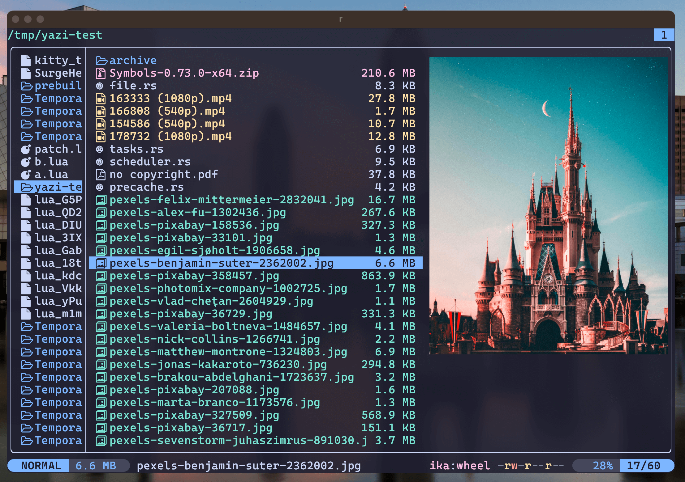

<p align="center">
    
    <h2 align="center">Rosé Pine for Yazi File Manager</h2>
</p>

<p align="center">All natural pine, faux fur and a bit of soho vibes for the classy minimalist</p>

## 👀 Preview



## 🎨 Installation

<!-- Please replace "username/example" with your repository name. -->
On Archlinux, Gentoo, or any other imperative distro.
```sh
ya pkg add rachitve6h2g/rose-pine
```

On NixOS Home-Manager.

```nix
{ pkgs, ... }: {
    programs.yazi = {
        flavors = {
            rose-pine = ( pkgs.fetchFromGithub {
                owner = "rachitve6h2g";
                repo = "rose-pine.yazi";
                rev = "3db994e71b0f42dd1f713a544c917145560ce5bb";
                hash = "sha256-hWFlVcpUEOoeBqkWw7Lmd6vlegW+vJvQrz54xvAkxc8=";
            });
        };

        theme = {
            flavor = {
                dark = "rose-pine";
            };
        };
    };
}
```

## ⚙️ Usage

<!--
Please replace "example" with your flavor name.

If your flavor uses a light color scheme, use "light" instead of "dark" wherever it appears below.
-->

To set it as your dark flavor, change the content of your `theme.toml` to:

```toml
[flavor]
dark = "rose-pine"
```

Make sure your `theme.toml` doesn't contain anything other than `[flavor]`, unless you want to override certain styles of this flavor.

See the [Yazi flavor documentation](https://yazi-rs.github.io/docs/flavors/overview) for more details.

## 📜 License

The flavor is MIT-licensed, and the included tmTheme is also MIT-licensed.

Check the [LICENSE](LICENSE) and [LICENSE-tmtheme](LICENSE-tmtheme) file for more details.


### TODO: 
- [ ] Add rose-pine icons using [icons-brew.yazi](https://github.com/lpnh/icons-brew.yazi).
- [ ] Add light theme variant.
